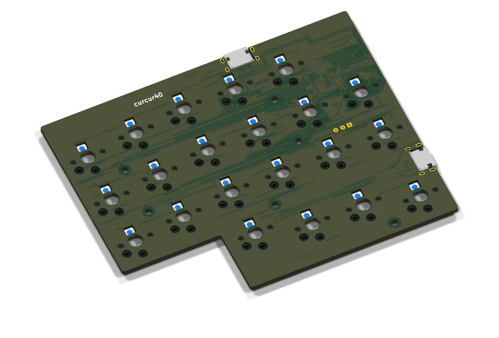
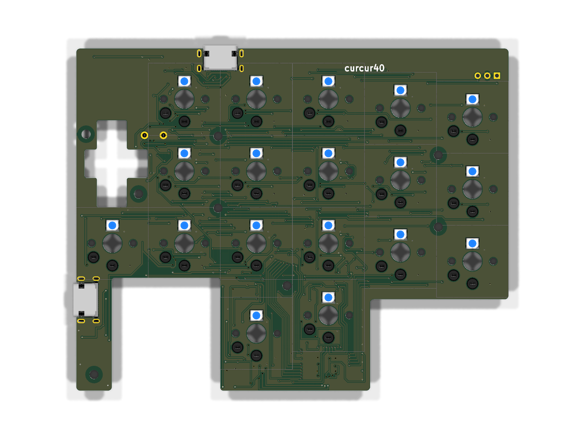
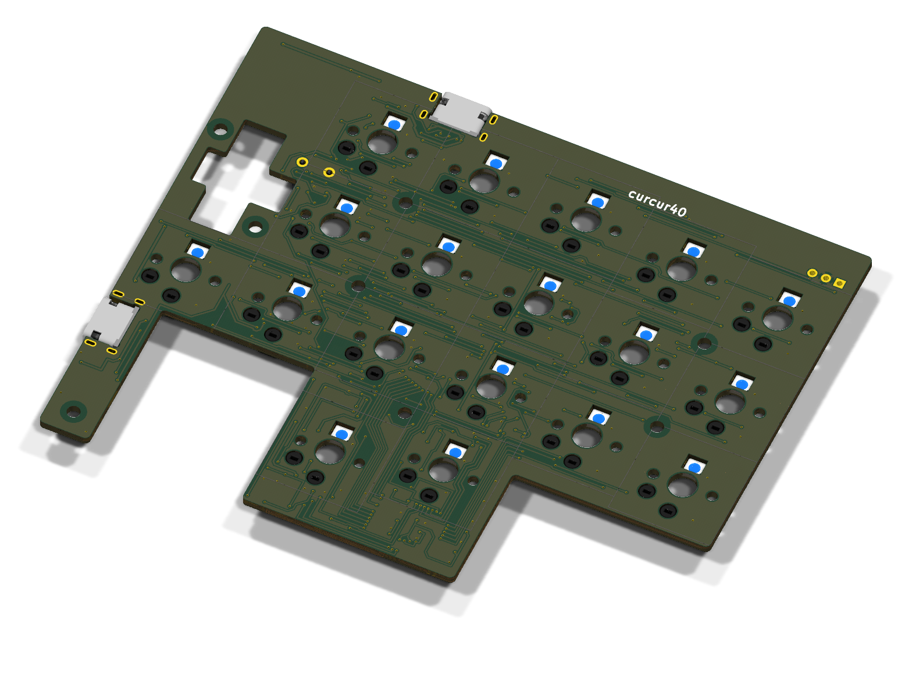
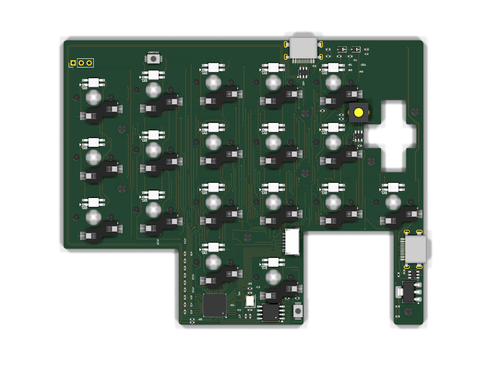
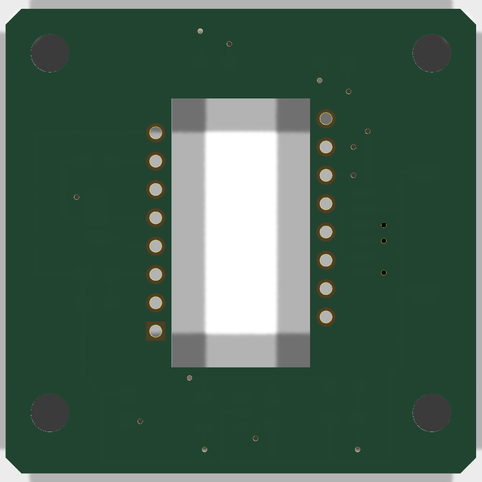
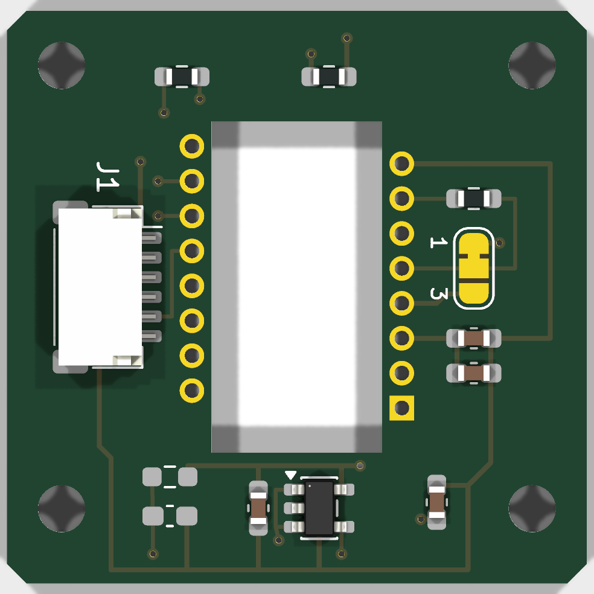
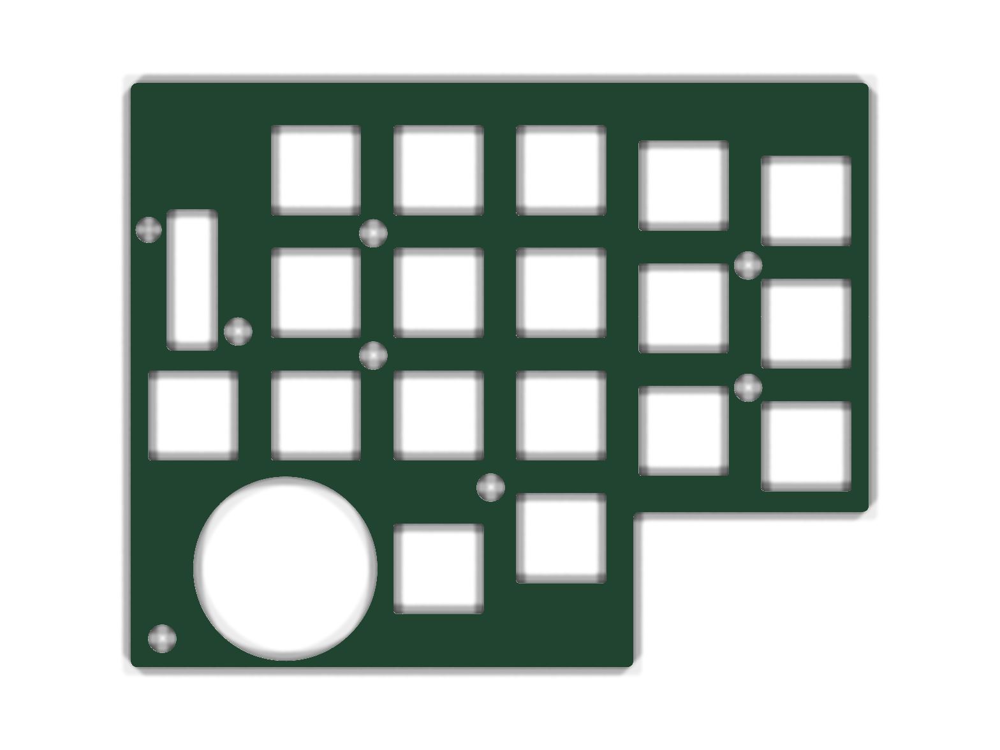
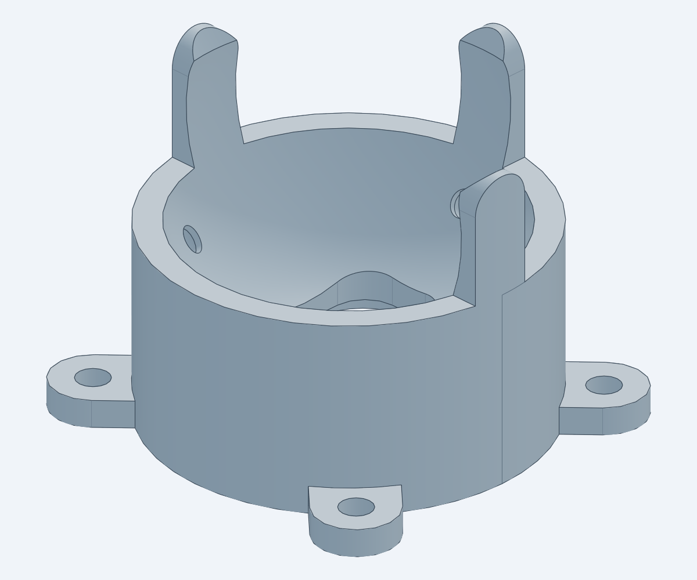
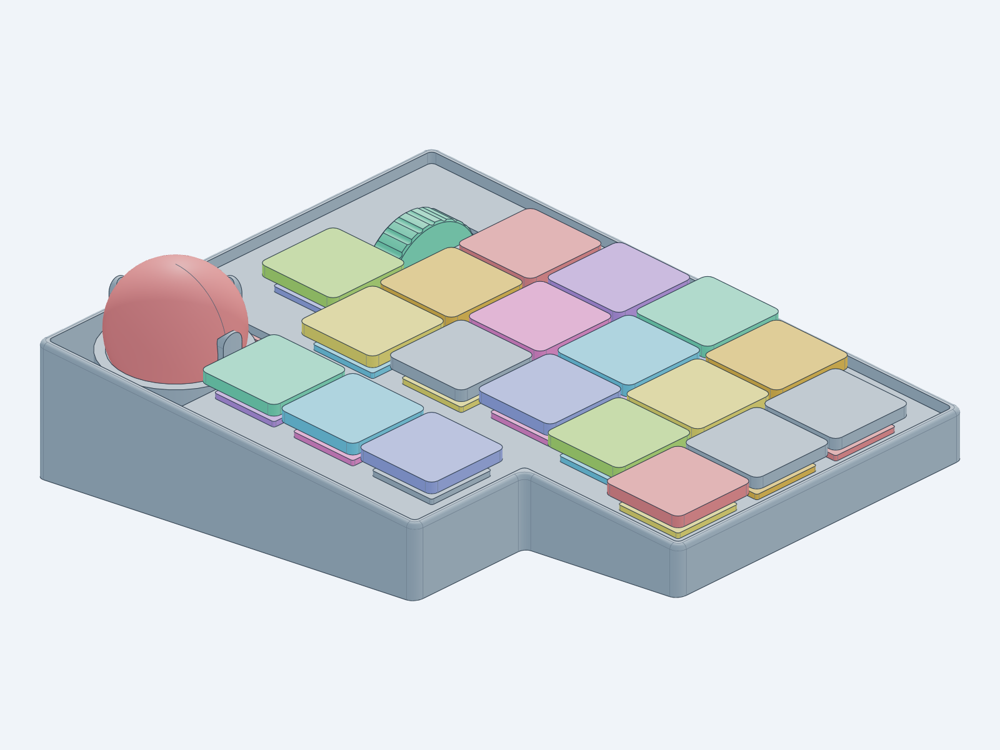

# curcur40

**curcur40** は、[Corne Keyboard (crkbd v4)](https://github.com/foostan/crkbd) をベースに、Kailh Choc V2（`CPG1353`）ロープロファイルスイッチ専用の **39キー（論理40スイッチ：左21キー＋右18キー＋ホイール中クリック1）左右分割レイアウト**、右手親指の **$\varnothing 25\,\text{mm}$ 光学式トラックボール（`PMW3360DM-T2QU` 低プロファイル分離センサーサブ基板・閉円形プレート開口）**、および右手人差し指内側の **アンダープレート 1ピース一体軸パッシブ磁気慣性ホイール（`45# Steel` 削り出しフライホイール ＋ 右メイン基板 PCBA 直実装 `TMAG5273` 3Dホール磁気センサ）** を統合し、筐体全体を **真鍮ヒートセットインサート × 統一 `M2 × 6.0mm` ネジ（100% 密閉・底面穴なしケース）** で構築したカスタム分割エルゴノミクスキーボードです。


---

## 主な特徴 (Key Features)

- **39キー（論理40スイッチ） + 25mm トラックボール + アンダープレート一体軸パッシブ磁気慣性ホイール**:
  - **左手 (21キー)**: メイン $3\times 5$ (15キー) ＋ 内側縦2キー (`EXSW1`, `EXSW2`) ＋ 親指4キー (`SW1`, `SW8`, `SW9`, `EXSW3`)
  - **右手 (18キー + 2デバイス)**: メイン $3\times 5$ (15キー) ＋ 内側下段1キー (`rEXSW2`) ＋ 親指外側2キー (`rSW8`, `rSW9`) ＋ **アンダープレート一体軸パッシブ磁気慣性ホイール（静音中クリック `rEXSW1` 付）** ＋ **$\varnothing 25\,\text{mm}$ トラックボール (`PMW3360DM-T2QU` + `LM19-LSI`)**
- **接着剤ゼロ・シムゼロ・手配線ゼロ・カバー不要・公式造形ガイドライン100%準拠の「アンダープレート 1ピース一体軸パッシブ磁気慣性ホイール」**:
  - **外径 $\varnothing 22.00 \times \text{幅 } 4.65\,\text{mm}$ リム（$R = 1.50\,\text{mm}$ 外周24フルート溝、東側 $5.05\,\text{mm}$ ホルダー収容のためリム中心を南側キー `rEXSW2` 中心から $-0.925\,\text{mm}$ 西オフセット）**・$\varnothing 3.00\,\text{mm}$ 内輪当たりフラット段付き肩（スパン $5.40\,\text{mm}$ ＋ DIN 509 $R=0.20\,\text{mm}$ 旋削逃げ溝付）・一体ベアリングジャーナル＆東側Dカット軸を単一鋼材から削り出した **1ピース `45# Steel`（`Blackening` 黒染め仕上げ）フライホイール（[`steel-flywheel.step`](./cases/inertia_wheel/steel-flywheel.step) ＋ 同名2D公差図面 [`steel-flywheel.pdf`](./cases/inertia_wheel/steel-flywheel.pdf), $13.51\,\text{g}$, $J = 774\,\text{g}\cdot\text{mm}^2$、軸公差 `⌀1.97 ±0.02 mm`）** と脱脂ミニチュアベアリング **`DDL-520ZZ`**（分離型Cクリップスナップイン保持）により、シムリング調整なしで滑らかな慣性フリースピンと剛性を実現。
  - 回転軸をプレート下（$Z = -7.38\,\text{mm}$）に配置することで、大径 $\varnothing 22.00\,\text{mm}$ ホイールでありながら頂点高さを **$Z = +3.62\,\text{mm}$（Choc V2 キーキャップ天面 $+3.60\,\text{mm}$ とほぼ完全ツライチ）** に揃えつつ、JLC3DP 公式最小造形サイズ（$\ge 5\times 5\times 5\,\text{mm}$）＆肉厚 $\ge 1.20\,\text{mm}$ に適合する **`#02` マグネットホルダー（$6.64 \times 6.64 \times 5.05\,\text{mm}$）** を収容し、トッププレート開口をホイールと同心（静止時左右 $0.95\,\text{mm}$ 等幅・フルクリック押下 $2.95^\circ$ 時も $\ge 0.30\,\text{mm}$ 余裕）のカバー不要な角丸長穴（$6.55 \times 22.00\,\text{mm}$）に集約。
  - 角度検出には右メイン基板 `B.Cu` へ回転軸と同軸（$Y = 2.7625\,\text{mm}$）で PCBA 自動実装された 3軸リニアホールIC **`rU6`（`TMAG5273A1QDBVR`）**、中クリックには基板直付けの静音スイッチ **`rEXSW1`（`Kailh Square Silent`）** を採用し、さらに `#03` シーソーロッカー（$\varnothing 3.20\,\text{mm}$ トラニオン軸）と南開放U字 `#04` クレードル（盲穴 $5.30\,\text{mm}$, $h/\Phi = 1.86 \le 3.0$）を **サドル底面接線支持 $\varnothing 3.50\,\text{mm}$ スリット分離型 Cクリップスナップインヒンジ（西側過荷重ハードストップ付）** で機械連結（**ホイール用サブ基板・JST SH コネクタ・手配線ハーネスは完全廃止**）。南ボス（上面開放トラフ＋$\varnothing 2.30\,\text{mm}$ ガイドリング＋肉厚 $2.25\,\text{mm}$ 下部キーパー壁）の鉄製 `M2×6.0mm` ネジ先端に自己磁力で吸着させた $\varnothing 2\times 2\,\text{mm}$ ネオジム磁石（`NE280`）と強磁性スチールホイールの24溝により、接着剤も鋼球ハブも使わずにノッチ強弱を無段階調整可能。
- **全19箇所 真鍮ヒートセットインサート ＆ 統一 `M2 × 6.0mm` ネジ（キー谷間 $\varnothing 5.20\,\text{mm}$ フラットボス・USB-C 内壁基板受け棚・スイッチ嵌合トッププレート ＆ 100% 密閉フラット底面ケース）**:
  - 旧来の `5.50mm` スペーサーおよびケース底面ザグリ穴を全面廃止し、キーボード全体の全19箇所（左手キー谷間 `L1`〜`L6` 6箇所 ＋ 右手キー谷間 `R1`〜`R6` 6箇所 ＋ トラックボールカップ `TB1`〜`TB4` 4箇所 ＋ ホイールクレードル `WC1`/`WC2` 2箇所 ＋ ホイール磁力調整 1箇所）すべてを **`M2 × L=3.0 × OD=3.2mm` 真鍮ヒートセットインサート（19個）** と **同一サイズの `M2 × 6.0mm` なべ小ねじ（19本、標準頭径 $\varnothing 3.5\,\text{mm}$）** に完全統一。
  - 左右のメイン基板固定穴は、外周余白で目立っていたネジ穴を全廃し、**キー間谷間・死角 6点ずつ（計12箇所：`L1`〜`L6` および `R1`〜`R6`）** へ配置。すべて **段差ゼロのコンパクトな $\varnothing 5.20\,\text{mm}$ 単段フラット円筒ボス（天面 $Z = -5.80\,\text{mm}$、片側均一肉厚 $1.175\,\text{mm}$）** に統一し、さらに USB-C ポート近傍のケース内壁死角に一体成形した **3箇所の基板受け棚（$Z = -5.80\,\text{mm}$）** がケーブル挿抜時の下向き荷重を強固に支持します。トッププレートは全14箇所（`WC1` のみ $\varnothing 4.05\,\text{mm}$、他13箇所 $\varnothing 4.40\,\text{mm}$）をネジ頭逃げ穴としてネジ頭をプレート下に沈み込ませ、39個の Kailh Choc V2 キースイッチ嵌合でスマートに保持されます（KiCad 10.0 実3D部品モデル＋嵌合 JST `SHR-06V-S-B` ハウジング2個を統合し、全ソリッドの干渉ゼロ＆全パーツ6自由度拘束を自動検証済み）。
  - 普通のはんだごて（220〜250℃）で PA12 ナイロンケースの下穴（$\varnothing 2.85\,\text{mm}$）へインサートを押し込む片側上方向締結により、ケース外底面は **内部への貫通穴・ネジザグリ穴が一切ない 100% 密閉底面**（ベース角 $\theta_{\text{tent}} = 11.80^\circ$：小指端全高 $14.20\,\text{mm}$ 〜 親指内端全高 $39.02\,\text{mm}$、フットプリント $118.81 \times 94.40\,\text{mm}$）を実現。さらに外底面には市販の **`20 × 65 × 5 mm` 折りたたみミニスタンドを片側2本・X軸平行（左右鏡像対称・計4本）でツライチ収納できるブラインドポケット＋爪掛け凹み**（深さ $5.20\,\text{mm}$、密閉隔壁 $\ge 1.09 \sim 1.26\,\text{mm}$）を備え、収納時は $11.80^\circ$ ロープロファイル、展開時は前後2本平行で歪みなく **約 $24^\circ$ / 約 $34^\circ$ のハイテンティング** へワンタッチで切り替え可能。
- **低プロファイル沈み込み・閉円形プレート開口・乗り上げ防止設計 25mm トラックボール**:
  - PMW3360 回路を独立サブ基板 [`curcur40-pmw3360`](./pcbs/pmw3360/curcur40-pmw3360.kicad_pcb)（$Z = -20.60 \sim -19.00\,\text{mm}$）へ $-14.80\,\text{mm}$ 沈み込ませて分離し、トラックボールカップ円形リム（$Z = -5.00\,\text{mm}$）を右トッププレートの **$\varnothing 28.625\,\text{mm}$ 閉円形開口** の奥へスマートに収めつつ、右メイン基板 `rJ3` とセンサー基板 `J1` を JST SH 6ピン両端同方向フラットケーブル1本で接続。
  - 底面極から $55.0^\circ$（方位角 $90^\circ, 210^\circ, 330^\circ$）の高位置 $\varnothing 2.0\,\text{mm}$ セラミック球 3点支持・片側 $+0.25\,\text{mm}$ 球面クリアランス・T字スリム3爪（スロート径 $\varnothing 24.59\,\text{mm}$、バネ長 $7.67\,\text{mm}$）により、高速フリック時の乗り上げ防止と滑らかな回転・逆さ落下防止・裏押出穴なしでの素手着脱性を両立。
- **3-in-1 統合 PCBA パネル対応 ＆ RP2040 オンボード・デュアル USB-C QMK / Vial 完全対応**:
  - 左メイン基板・右メイン基板・PMW3360 センサーサブ基板の全3枚を 1枚の捨て基板フレーム（[`curcur40-panel-3in1`](./pcbs/panel/curcur40-panel-3in1.kicad_pcb), $131.05 \times 207.25\,\text{mm}$）へ統合し、**JLCPCB Economic PCBA 1アイテムで一括実装発注**が可能。
  - 左右とも `RP2040` + `16MB` QSPI Flash + ST製新世代低ドロップアウト 3.3V LDO（`LDL1117S33R`）をオンボード実装し、PC接続（北側 `J1`/`rJ1`）および左右間接続（親指内側 `J2`/`rJ2`、`USBLC6-2SC6` ESD保護・コールドソケット誤挿し保護搭載）ともに USB Type-C を採用。
  - ファームウェアには **`TMAG5273` 3Dホール慣性ホイール駆動**（`XZX` 擬似同時サンプリングで高速スピン位相遅れを解消、物理24溝と同期した `24 notches/rev`、`TLV493D-A1B6` 自動フォールバック、`WHL_HRZ` 水平スクロール切替対応［`Shift` 併用時は標準の OS 側 `Shift + 縦スクロール` 挙動に委譲］）と **`PMW3360` トラックボールの 2D 慣性高速ドラッグスクロール** を統合し、Vial GUI からリアルタイムに設定変更可能。

---

## ドキュメント・設計仕様書 (Documentation)

| ドキュメント | 内容 |
| :--- | :--- |
| **[ビルドガイド (`docs/buildguide_jp.md`)](./docs/buildguide_jp.md)** | 必要パーツ一覧（BOM）、JLCPCB / JLC3DP / JLCCNC 発注手順、真鍮ヒートセットインサート圧入、慣性ホイール＆トラックボール組立、ファームウェア書き込み手順 |
| **[購入部材・製造委託パーツリファレンス (`docs/parts_spec.md`)](./docs/parts_spec.md)** | ベアリング（`DDL-520ZZ`）・磁石（`D4×1mm`, `NE280`）・静音スイッチ・真鍮インサート・統一 `M2×6mm` ネジ・委託造形品の確定型番と購入先URL一覧 |
| **[ケース・機構設計仕様書 (`docs/case_spec.md`)](./docs/case_spec.md)** | Z軸スタックアップ定義、19箇所真鍮ヒートセットインサート＋統一 `M2×6.0mm` ネジ締結仕様、USB-C内壁基板受け棚、100%密閉底面ケース、トラックボールカップ＆光学距離（$2.40\,\text{mm}$）仕様、持ち運び用上下リバーシブル・キャリングボックス仕様 |
| **[PCB・回路図設計仕様書 (`docs/pcb_spec.md`)](./docs/pcb_spec.md)** | 全3基板（`left`, `right`, `pmw3360`）の回路構成、オンボード3Dホール `rU6` (`TMAG5273`) ＆ `rEXSW1` 仕様、RP2040 GPIO ピンアサイン表、DRC/ERC 検証基準 |
| **[パッシブ磁気慣性ホイール設計仕様書 (`docs/passive_inertia_wheel_spec.md`)](./docs/passive_inertia_wheel_spec.md)** | **小学生でもわかる「3つのしくみ」図解**、1ピース一体軸 `45# Steel` ホイールの物理設計＆JLCCNC 2D公差図面、JLC3DP 公式準拠マグネットホルダー・Cクリップシーソー機構、6自由度拘束検証、`XZX` 3Dホール角度復調アルゴリズム |
| **[さわって動かせる！3つのしくみインタラクティブ図解 (`docs/wheel_mechanism_guide.html`)](./docs/wheel_mechanism_guide.html)** | ブラウザでオフライン動作する体験型 HTML ガイド（ホイールのフリック高速スピン、ノッチ調整ネジスライダー、Cクリップシーソー中クリックを実際に操作可能） |
| **[まっすぐ引くだけでフタが抜けるしくみ図解 (`docs/carrying_box_lid_guide.html`)](./docs/carrying_box_lid_guide.html)** | ブラウザでオフライン動作する体験型 HTML ガイド（キャリングボックスの $26^\circ$ 浅角カム坂道・$14\,\text{mm}$ 長スパン弾性梁によるスナップフタ開閉動作をスライダーで操作可能） |
| **[生成スクリプト一覧 (`scripts/README.md`)](./scripts/README.md)** | 3Dモデル（ケース・カップ・慣性ホイール・キャリングボックス・フルアセンブリ）、トッププレート、JLCPCB 発注データ、図版・プレビュー画像・3D組み立てアニメーション動画の再現生成スクリプト（全12本）の説明 |

---

## 3D プレビュー・完成イメージギャラリー (3D Preview Gallery)

KiCad 10.0 Raytracing（`kicad-cli pcb render`）、`cadgen` 3D CAD レンダラー、および PyVista PBR レンダラーで出力した完成イメージ・組み立て動画一覧です。

- 🎬 **[3D 組み立てアニメーション動画 (`docs/assets/assembly_animation.mp4`, 1080p 60fps)](./docs/assets/assembly_animation.mp4)** — トラックボールユニット ＆ パッシブ磁気慣性ホイールのサブ組立から、白ケース・黒PCB・黒トッププレート・スイッチ・白キーキャップ・25mmボールの積み上げ完成までを収録した PBR 3D 動画

### 1. フルアセンブリ（密閉底面3Dプリントケース + メイン基板 + トッププレート + 25mmトラックボール + アンダープレート一体軸慣性ホイール）

#### 斜視図（アイソメトリックビュー）


#### 上面図（トップビュー：カバー不要のスマートなホイールスロット＆ネジ頭沈み込みプレート）


#### 底面図（ボトムビュー：内部貫通穴ゼロの 100% 密閉底面 ＋ `20×65×5mm` 折りたたみスタンド平行2本埋め込みポケット）


---

### 2. 左手メイン基板 (`curcur40-left`)
- **構成**: 21キー（メイン $3\times 5$ + 内側 1u×2 + 親指 1u×4）、板厚 `1.60 mm` 裏面 PCBA
- **制御回路**: `RP2040` + `W25Q128JVSIQ` (16MB) + デュアル USB Type-C（北側 `J1`・内側 `J2`、ESD保護・逆流防止ダイオード搭載）
- **基板固定構造**: 左右完全対称のキー谷間6箇所（`L1`〜`L6`、外周余白穴ゼロ）すべてシンプルな **$\varnothing 2.40\,\text{mm}$ 円穴**（太穴や南開放U溝なし）とし、ケースの $\varnothing 5.20\,\text{mm}$ フラット円筒ボスへ `M2×6.0mm` ネジで直接締結（USB-C近傍3箇所はケース内壁基板受け棚で下支え）

#### 表面（スイッチ差し込み面 / `F.Cu`）


#### 斜視図 ＆ 裏面（部品実装面 / `B.Cu`）
| 斜視図（アイソメトリックビュー） | 裏面（部品実装面 / `B.Cu`） |
| :---: | :---: |
|  |  |

---

### 3. 右手メイン基板 (`curcur40-right`) ＆ トラックボールセンサーサブ基板 (`curcur40-pmw3360`)
- **構成**: 18キー ＋ **アンダープレート一体軸ホイール十字切り欠き窓 ＆ オンボード `rU6` (`TMAG5273`) / `rEXSW1` (`Kailh Square Silent`)** ＋ **25mm トラックボール光学センサーサブ基板**（`rJ3` ⇔ `J1` JST SH 6ピン接続）
- **サブ基板1枚のみのシンプル構成**:
  - 慣性ホイールの3Dホールセンサー `rU6`（`TMAG5273A1QDBVR`, LCSC `C3716049`）は右メイン基板 `B.Cu` に PCBA 実装され、静音中クリックスイッチ `rEXSW1` も右メイン基板 `B.Cu` に直接ハンダ付けされるため、ホイール用の別基板やハーネスは一切不要です。
  - トラックボール用の [`curcur40-pmw3360`](./pcbs/pmw3360/curcur40-pmw3360.kicad_pcb) のみを $-14.80\,\text{mm}$ 下段（$Z = -20.60 \sim -19.00\,\text{mm}$）に分離し、唯一の JST SH 6ピン両端同方向ケーブル（`rJ3` ⇔ `J1`）で接続します（裏面 `JP1` は銅箔パターンで `+3V3R` 直結済み）。

#### 右メイン基板 表面（`F.Cu`）・斜視図・裏面（`B.Cu`：`rU6`, `rEXSW1`, `rJ3` 搭載）


| 斜視図（アイソメトリックビュー） | 裏面（SMD部品・オンボード `rU6`・`rJ3` 実装面 / `B.Cu`） |
| :---: | :---: |
|  |  |

#### トラックボールセンサーサブ基板 (`curcur40-pmw3360`) プレビュー
| TBセンサー基板 表面 (`F.Cu`) | TBセンサー基板 裏面 (`B.Cu`) |
| :---: | :---: |
|  |  |

---

### 4. FR-4 トッププレート (`plate-top-left` / `plate-top-right`)
- **材質・板厚**: FR-4（ガラスエポキシ基板材）、板厚 $1.60\,\text{mm}$（$Z = -3.60 \sim -2.00\,\text{mm}$）
- **全14箇所 ネジ頭沈み込み逃げ穴（$\varnothing 4.40\,\text{mm}$ / `WC1` のみ $\varnothing 4.05\,\text{mm}$）＆ スイッチ嵌合保持**: 左6箇所（`L1`〜`L6`）および右8箇所（`R1`〜`R6, WC1, WC2`）の全14箇所すべてをキーキャップ間の死角に配置したネジ頭逃げ穴（`WC1` のみ外縁ブリッジ幅 $0.75\,\text{mm}$ 確保のため $\varnothing 4.05\,\text{mm}$、他13箇所 $\varnothing 4.40\,\text{mm}$）とし（外周余白のむき出しネジ穴ゼロ）、`M2×6.0mm` ネジ頭をメイン基板 `F.Cu`（$Z = -4.20\,\text{mm}$）へ着座させてプレート天面（$Z = -2.00\,\text{mm}$）より下に完全沈み込ませています（キー押下時の干渉ゼロ）。プレート自体は Kailh Choc V2 キースイッチ（左21個・右18個）のラッチ嵌合により全周ガタなく保持されます。
- **右手プレート形状**: $4.65\,\text{mm}$ 幅ホイールと同心に揃えた（静止時左右 $0.95\,\text{mm}$ 等幅・東ベアリング遮蔽）カバー不要のシンプルな $6.55 \times 22.00\,\text{mm}$（$R = 1.00\,\text{mm}$）ホイール長穴と、親指部の **$\varnothing 28.625\,\text{mm}$ 閉円形トラックボール開口** を備えたクリーンな造形です。

| 左手トッププレート (`plate-top-left`) | 右手トッププレート (`plate-top-right`) |
| :---: | :---: |
|  |  |

---

### 5. トラックボールカップ ＆ アンダープレート一体軸パッシブ磁気慣性ホイール
5つの光学・フルアセンブリ STEP モデルには、GUI（CAD Viewer等）で 25mm ボール底面との規定光学距離（設計値 **$2.40\,\text{mm}$**）を直接計測できるよう独立オブジェクト **`Lens_Optical_Ref_Point`** が収録されています。

| トラックボールカップ単体 (`cases/trackball-cup.step`) | 25mmボール・レンズ組込 (`cases/assemblies/trackball-cup-with-ball.step`) |
| :---: | :---: |
|  |  |

| 右手アンダープレート慣性ホイール実装 (`curcur40-right-wheel-assembly.step`) | アンダープレート一体軸ホイール機構単体 (`inertia-wheel-assembly.step`) |
| :---: | :---: |
|  |  |

#### 小学生でもわかる！高速スクロールホイールの「3つのしくみ」と `#02` の場所
> 💡 ブラウザで実際にホイールを弾いたりネジ・クリックを動かして遊べる **[インタラクティブ HTML 版 (`docs/wheel_mechanism_guide.html`)](./docs/wheel_mechanism_guide.html)** も収録しています。


---

### 6. 持ち運び用キャリングボックス（オプション：上下リバーシブル・スナップフタ付き6面フルカバー）

左右ケースの $11.80^\circ$ ビルトインテンティング傾斜を互い違いの向き（左手を $X$ 軸まわりに $180^\circ$ 反転）で対面させて相殺し、**底面埋め込み折りたたみスタンド4本・高さ $\le 3.0\,\text{mm}$ ゴム足・25mm トラックボール・全 4 箇所の USB-C マグネット端子（`CIO-SLMG-T-C`）を装着したまま** 真の $90^\circ$ 直方体ブロックとして安全に持ち運べる `PA12` キャリングボックス（[`carrying-box.step`](./cases/carrying-box.step) ＋ [`carrying-box-lid.step`](./cases/carrying-box-lid.step)）を用意しています。

- **箱もフタも上下逆さま区別なし（完全点対称 $140.20 \times 110.44 \times 80.25\,\text{mm}$）**: 点対称クランク段差ディバイダ＋左右デュアル 25mm 球キーパー溝により、**右手トラックボール側を下にしても上にしても（箱・フタの上下向きを一切見ずに）そのままスッと差し込んで閉められます**。天板・底板の内側に深さ $4.00\,\text{mm}$ の掘り込みレールを備えており、高さ $3.00\,\text{mm}$ の厚手ゴム足でも常時 **$1.00\,\text{mm}$ 以上** 空中に浮いたままスムーズにスライドします。奥面とフタ内面には外へ貫通しない **デュアル内部「堀」＋ キーボード手前突き当たりストッパー段差** を備えています。
- **力学計算済みの長スパン $26^\circ$ 浅角カム式隠しスナップフタ**: 長さ $14.0\,\text{mm}$ の弾性梁と抜き角 $26^\circ$ の浅角カムにより偏心セルフロックを完全解消し、左右の指掛け溝を持って真っ直ぐ引くだけで **約 $9.7\,\text{N}$（約 $1.0\,\text{kgf}$、最大曲げひずみ $0.71\%$）** でスムーズに開閉できます。

> 💡 まっすぐ引っ張るだけでスナップフタが抜けるしくみをスライダーで体験できる **[インタラクティブ HTML 図解 (`docs/carrying_box_lid_guide.html`)](./docs/carrying_box_lid_guide.html)** も収録しています。

| フタ装着フルカバー収納 (`carrying-box-with-lid-assembly.step`) | フタ取り外し・スライド挿入時 (`carrying-box-assembly.step`) |
| :---: | :---: |
|  |  |

| ボックス単体 (`cases/carrying-box.step`) | 差込口正面（ゴム足フローティング＆中央 TB キーパー断面視） |
| :---: | :---: |
|  |  |

---

## リポジトリ構成と発注用データ (Repository Structure & Production Files)

```text
curcur40/
├── cases/                        # 3Dプリント・CNC切削用実部品 & 検証アセンブリ (STEP / STL)
│   ├── left.step / left.stl      # 左手密閉底面ボトムケース（トッププレート水平基準）
│   ├── left-desk.step / .stl     # 左手密閉底面ボトムケース（ケース外底面＝デスク水平基準・JLC3DP推奨）
│   ├── right.step / right.stl    # 右手密閉底面ボトムケース（トッププレート水平基準）
│   ├── right-desk.step / .stl    # 右手密閉底面ボトムケース（ケース外底面＝デスク水平基準・JLC3DP推奨）
│   ├── trackball-cup.step / .stl # 25mmトラックボール用スナップインカップ（2.0mmフラット固定耳）
│   ├── carrying-box.step / .stl      # 【オプション】持ち運び用上下リバーシブル直方体スライドボックス本体 (JLC3DP PA12)
│   ├── carrying-box-lid.step / .stl  # 【オプション】スライドボックス用上下リバーシブル・スナップフタ (JLC3DP PA12)
│   ├── inertia_wheel/            # アンダープレート一体軸慣性ホイール実部品 4種 + CNC 2D公差図面
│   │   ├── steel-flywheel.step/.stl/.pdf  # #01 1ピース一体軸 45# Steel + 黒染めホイール & 同名2D公差図面 (JLCCNC)
│   │   ├── magnet-holder.step/.stl   # #02 公式最小サイズ適合 Ø6.64×5.05mm D4×1mm 磁石ホルダー (JLC3DP PA12)
│   │   ├── wheel-rocker.step/.stl    # #03 一体 Ø3.20mm トラニオン軸シーソーロッカー (JLC3DP PA12)
│   │   └── wheel-cradle.step/.stl    # #04 Cクリップスナップインヒンジ付アンダーPCBクレードル (JLC3DP PA12)
│   └── assemblies/               # 光学距離・干渉・クリアランス検証用アセンブリモデル 9種 (STEP / STL)
│       ├── assembly-full.step                    # KiCad実3D部品526個同期・全663ソリッド統合フルアセンブリ（トッププレート水平基準）
│       ├── assembly-full-desk.step               # KiCad実3D部品526個同期・全663ソリッド統合フルアセンブリ（ケース底面＝デスク面 Z=0 基準）
│       ├── carrying-box-assembly.step            # スライドボックス収納検証アセンブリ・フタ取り外し内部確認用（全678ソリッド）
│       ├── carrying-box-with-lid-assembly.step   # スライドボックス収納フルアセンブリ・フタ装着標準姿勢（全679ソリッド）
│       ├── curcur40-right-wheel-assembly.step    # 右手＋KiCad実3D部品＋アンダープレート慣性ホイール検証アセンブリ（338ソリッド）
│       ├── inertia-wheel-assembly.step           # アンダープレート慣性ホイール機構単体アセンブリ（14パーツ）
│       ├── trackball-cup-with-ball.step/.stl     # カップ＋25mm球＋光学基準点アセンブリ
│       ├── pmw3360-lens-pcb-assembly.step        # PMW3360＋LM19レンズ＋サブ基板光学モジュール
│       └── trackball-sensor-assembly.step        # カップ＋25mm球＋センサーサブ基板統合アセンブリ
├── pcbs/                         # KiCad 10.0 全3基板 + 3-in-1 統合パネル (すべて 1.6mm Bottom PCBA) & JLCPCB 発注データ
│   ├── panel/                    # 【推奨】3-in-1 統合 PCBA パネル (curcur40-panel-3in1: Left + Right + PMW3360)
│   ├── left/                     # 左手メイン基板 (curcur40-left)
│   ├── right/                    # 右手メイン基板 (curcur40-right: オンボード rU6 TMAG5273 & rEXSW1 搭載)
│   ├── pmw3360/                  # トラックボールセンサーサブ基板 (curcur40-pmw3360)
│   └── common/kbd/               # プロジェクト固有 KiCad シンボル・フットプリント・3Dモデルライブラリ
├── plates/                       # FR-4 トッププレート KiCad PCB / Gerber & レーザーカット用 SVG
│   ├── pcb/                      # plate-top-left.kicad_pcb, plate-top-right.kicad_pcb
│   └── svg/                      # plate-curcur40.svg, foam-curcur40.svg
├── kbd_firmware/                 # QMK / Vial ファームウェアソース (keyboards/curcur40)
├── docs/                         # ビルドガイド・設計仕様書・購入部材リファレンス・体験型HTML・図版アセット
│   ├── buildguide_jp.md
│   ├── parts_spec.md
│   ├── case_spec.md
│   ├── pcb_spec.md
│   ├── passive_inertia_wheel_spec.md
│   ├── wheel_mechanism_guide.html
│   ├── carrying_box_lid_guide.html
│   └── assets/
└── scripts/                      # 3Dモデル・プレート・JLCPCBデータ・プレビュー画像の公式生成スクリプト群（12本）
```

---

## ライセンス・謝辞 (License & Credits)

本プロジェクトは、以下のオープンソースハードウェア／ソフトウェアプロジェクトの成果をベースに派生・統合して作成されています。各オリジナル作者の皆様に深く感謝いたします。

| 対象領域 / ファイル | 派生元リポジトリ・原著作者 | 適用ライセンス | 改変履歴・表示事項（CC BY 4.0 Sec. 3(a) / CERN-OHL-P v2 Sec. 3.3 準拠） |
| :--- | :--- | :--- | :--- |
| **基板・プレート・ケース・慣性ホイール・ドキュメント・スクリプト**<br>(`pcbs/`, `plates/`, `cases/`, `docs/`, `scripts/`) | **[foostan/crkbd](https://github.com/foostan/crkbd)**<br>(Original Author: `foostan` / Kosuke Adachi) | **[MIT License](./LICENSE_MIT)** ＆<br>**[CC BY 4.0](./LICENSE_CC)** | Corne v4 (`corne-chocolate`) をベースに、40キー配列化・親指クラスタ再配置・右手 PMW3360 トラックボール（低プロファイルサブ基板分離）＆アンダープレート一体軸パッシブ磁気慣性ホイール（`45# Steel` ロータ + オンボード `TMAG5273` 3Dホール）統合・KiCad 10.0 対応・ヒートセット密閉底面3Dプリントケース＆トラックボールカップ新規設計を実施（`2026-10`） |
| **プロジェクト固有 KiCad ライブラリ（Corne 由来）**<br>(`pcbs/common/kbd/kicad-symbols/kbd.kicad_sym`, `kbd.pretty/`, `kicad-packages3D/kbd.3dshapes/`) | **[foostan/kbd](https://github.com/foostan/kbd)**<br>(Original Author: `foostan`) | **[MIT License](./pcbs/common/kbd/LICENSE)** | `2026-10`: 未使用シンボル・フットプリント・3Dモデルを整理し、KiCad 10.0 標準シンボルとのピン名・フィルタ整合、`YS-SK6812MINI-E` Pin 2 (`DOUT`) 電気タイプ修正、`keyswitch_choc12_hotswap_1u` の旧 $\varnothing 0.40\,\text{mm}$ NPTH 穴削除、`Kailh_Square_Silent_6.2x6.2mm` 追加、環境非依存の相対パス化を実施 |
| **PMW3360 回路図シンボル・フットプリント**<br>(`pcbs/common/kbd/kicad-symbols/pmw3360_pcb.kicad_sym`, `PMW3360DM-T2QU_16Pin.kicad_mod`) | **[siderakb/pmw3360-pcb](https://github.com/siderakb/pmw3360-pcb)**<br>(Original Author: `siderakb` / `ziteh`) | **[CERN-OHL-P v2](./LICENSE_CERN_OHL_P_V2)**<br>(Permissive) | `2026-10`: 未使用の `TXS0108E-QPWRQ1` シンボルを削除、`PMW3360DM-T2QU` Pin 3 (`VDDPIX`) を `power_out` に変更、および `PMW3360DM-T2QU_16Pin.kicad_mod` のスルーホールパッド層定義を KiCad 10.0 向けに補完し専用センサーサブ基板 `curcur40-pmw3360` へ統合 |
| **ファームウェア定義 (`kbd_firmware/`)**<br>(`kbd_firmware/keyboards/curcur40/`) | **[foostan/kbd_firmware](https://github.com/foostan/kbd_firmware)**<br>**[QMK Firmware](https://github.com/qmk/qmk_firmware)** / **[Vial-QMK](https://github.com/vial-kb/vial-qmk)** | **GPL-2.0-or-later**<br>(`SPDX-License-Identifier: GPL-2.0-or-later`) | `crkbd/rev4_1/mini` の設定をベースに、論理40スイッチマトリックス（39 Choc V2 ＋ 1 ホイール中クリック）、I2C0 `TMAG5273`/`TLV493D-A1B6` 3Dホール慣性ホイール＆SPI1 `PMW3360` トラックボール（800 CPI・2D慣性ドラッグスクロール対応）複合ポインティングドライバへ改変 |
