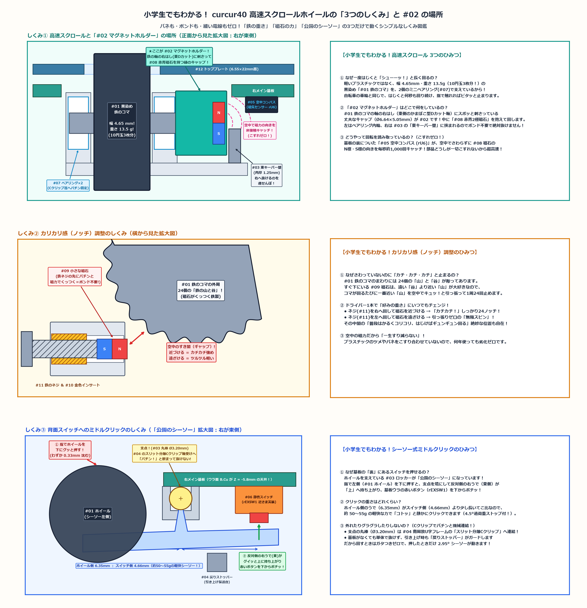
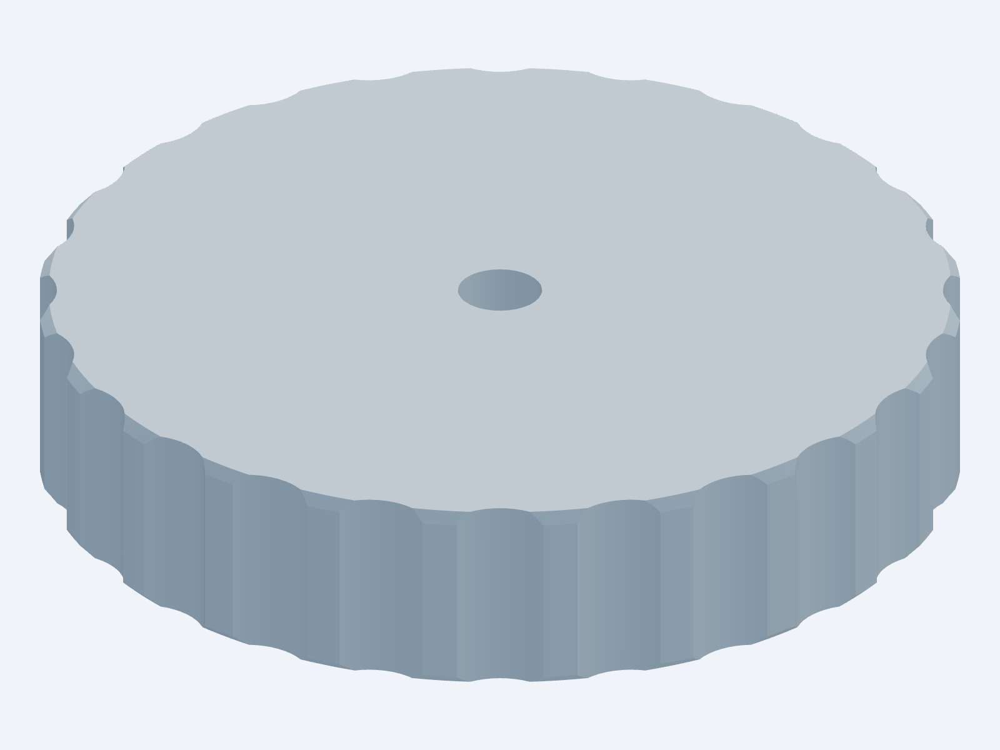
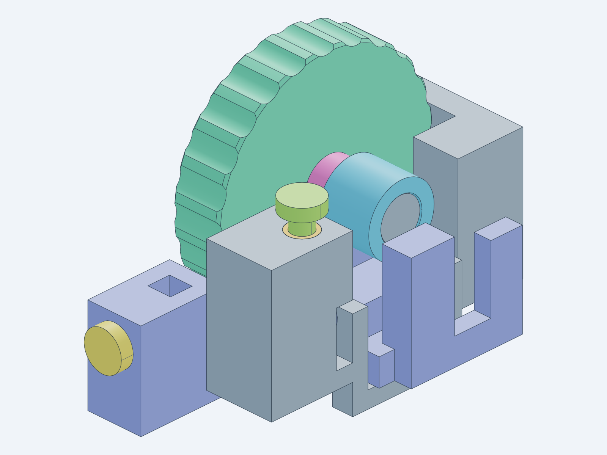
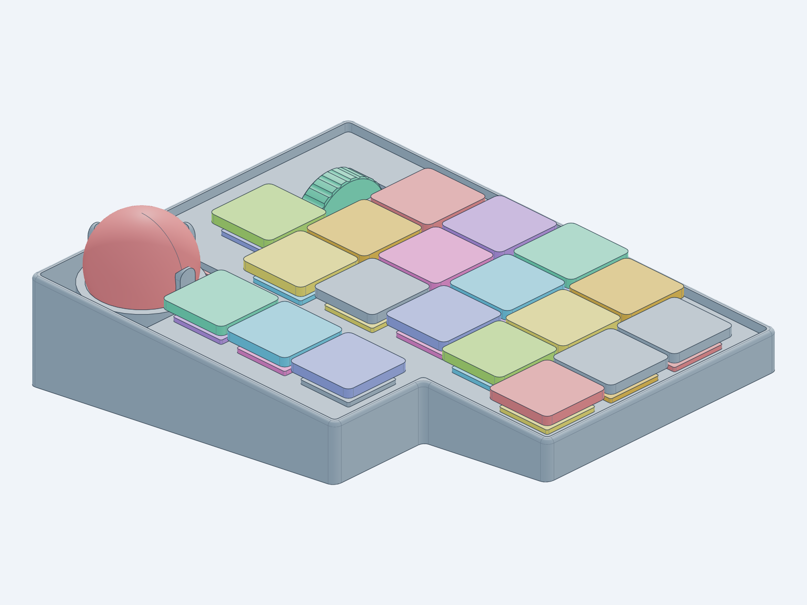
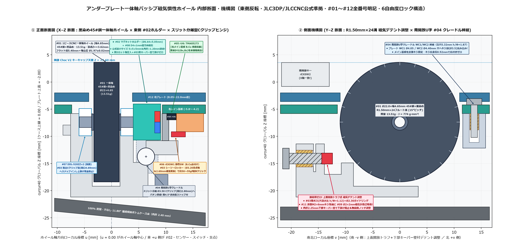

# アンダープレート一体軸パッシブ磁気慣性ホイール 設計仕様書

本書は、電磁クラッチ（ソレノイド・コイル・駆動回路）や専用サブ基板・手配線ハーネス・接着剤・シムリング・スナップカバーを一切使わずに、**「1ピース一体軸 `45# Steel` CNC フライホイール（$\varnothing 22.00 \times 4.65\,\text{mm}$, $13.51\,\text{g}$、黒染め仕上げ＋同名2D公差図面 [`steel-flywheel.pdf`](../cases/inertia_wheel/steel-flywheel.pdf) 付属） × 脱脂 `DDL-520ZZ` ミニチュアベアリング × 接着剤ゼロ・抜け止め付きの24極磁気デテント × 右メイン基板 PCBA 直実装 3Dホールセンサー（`TMAG5273`）」** によって、**『普段は心地よい24ノッチ感があり、指で弾けば慣性モーメント（$J \approx 774\,\text{g}\cdot\text{mm}^2$）で数秒間回り続け、指で触れれば瞬時にピタッと止まる』** 高速慣性スクロール＆静音ミドルクリックを実現し、かつ **JLC3DP / JLCCNC 公式デザインガイドライン・発注ガイドラインの全項目（最小造形サイズ $\ge 5\times 5\times 5\,\text{mm}$、穴深さ比 $h/\Phi \le 3.0$、肉厚 $\ge 1.20\,\text{mm}$／突起・爪 $\ge 1.50\,\text{mm}$、CNC 工具最小 $R=1.50\,\text{mm}$、公差 $\pm 0.02\,\text{mm}$）に100%準拠**したハードウェア・ファームウェア設計仕様書です。

---

## 0. やさしい図解：小学生でもわかる！「3つのしくみ」と `#02` の場所

部品が多く見えるホイール機構も、実は **「① 重い鉄のコマと空中コンパス」「② 24個の鉄の山と磁石ネジ」「③ 公園のシーソー」** の3つのシンプルな原理だけで動いています。バネも、接着剤（ボンド）も、切れやすい細い電線も一切使っていません。

> [!TIP]
> **🎡 ブラウザで実際にさわって動かせる「インタラクティブHTML図解版」を収録！**
> GitHub の Markdown 上ではセキュリティ仕様により JavaScript を直接実行できないため、チャットでお見せした **「指で弾いてホイールを回転させる」「スライダーでネジを回してノッチ強弱を変える」「ボタンを押してシーソーで裏スイッチをクリックする」** インタラクティブ図解をそのままオフライン単体で動く **[`docs/wheel_mechanism_guide.html`](./wheel_mechanism_guide.html)** として収録しています（PCやスマホのブラウザでダブルクリックして開くだけでそのまま遊べます！）。

### 0.1 高速スクロールのしくみと `#02 マグネットホルダー` の場所（「重い鉄のコマ × 空中コンパス」）
* **なぜ一度はじくと「シューーーッ！」と長く回り続けるの？**
  軽いプラスチックではなく、**幅 $4.65\,\text{mm}$・重さ $13.51\,\text{g}$（10円玉3枚分のズッシリ感！）** の「`#01` 鉄のコマ」を、2個のミニチュアベアリング（`#07`）で支えているからです。自転車の車輪と同じで、指ではじけば重さの勢い（慣性）で何秒も回り続け、止めたいときは指先で軽く触れるだけでその瞬間にピタッと止まります。
* **`#02 マグネットホルダー` はどこで何をしているの？**
  `#01` 鉄のコマから右（東・キーマトリクス側）へ伸びた「かまぼこ型（Dカット）の鉄の軸」の先端にスポッと刺さっている**小さな丸いキャップ（$\varnothing 6.64 \times 5.05\,\text{mm}$）が `#02 マグネットホルダー`** です。中に **`#08` 赤青2極磁石（N極・S極）** を入れて軸と一緒にくるくる回します。左側は東ベアリング内輪と鉄の軸の段差、右側は `#03` ロッカーから立ち上がる **「抜け止め壁（キーパータブ）」** に挟まれているため、**接着剤ゼロでも絶対に抜け落ちません**。
* **どうやって回転を読み取っているの？（こすれゼロ！）**
  右メイン基板の裏面に最初から付いている **`#05` 空中コンパス（3D磁気センサー `rU6: TMAG5273`）** が、`#08` 磁石に一切触れずに空中から「いま磁石が何時の方角を向いているか」を毎秒約1,000回キャッチします。こすれる部品がゼロなのでブレーキがかかりません。

### 0.2 ノッチ（カリカリ感）調整のしくみ（「24個の鉄の山 × 磁石つきネジの距離あそび」）
* **`#01` 鉄のコマの外周には 24個の「山」と「谷」** が彫られています。そのすぐ南側（親指側）のトンネル（`#03` 南ボス＋`#10` 真鍮インサート）に **`#11` 鉄のネジ** をねじ込み、ネジの先端に **`#09` 小さな磁石** を磁力でパチンとくっつけます（ボンド不要！）。
* 磁石は遠い「谷」より近い「山」を強く引っ張るため、コマが回るたびに山から山へ **1周24回の「カチ・カチ・カチ！」という気持ちいいノッチ感** が生まれます。
* **ドライバー1本で好みの重さにチューニング可能！（基板へのネジ止め前に調整）**:
  * **ネジを右へ回して磁石を近づける** → 磁力が強まり「カチカチ！」としっかり止まる24ノッチモード（最奥まで締めても北端の抜け止め顎が磁石を確実にストップするため、ホイールに磁石が張り付く心配はゼロ！）
  * **ネジを左へ回して磁石を遠ざける** → 磁力がフワッと弱まり、引っかかりゼロの「ツルツル無限スピン」モード
  * 空中の磁力で引っ張っているだけなので、プラスチックのツメやバネと違って **何万回まわしても一生すり減りません**（※調整ネジは右メイン基板の下に収まるため、右メイン基板へ `WC1`/`WC2` ネジで固定する前の単体状態で好みの感触へ合わせておきます）。

### 0.3 背面スイッチへのミドルクリックのしくみ（「パチンと連結したCクリップ支点のシーソーで基板ウラの赤いボタンを下からポチッ！」）
* ホイールを支えている `#03 シーソーロッカー` は、文字どおり **「公園のシーソー」** になっています。
* 真ん中の丸い支点棒（直径 $\varnothing 3.20\,\text{mm}$）は、`#04 クレードル` の **「スリット分離型Cクリップ軸受け（内径 $\varnothing 3.50\,\text{mm}$・上開口 $2.80\,\text{mm}$・肉厚 $1.55\,\text{mm}$）」** に上から **「パチン！」と弾性スナップイン連結** されます。だから基板にネジ止めする前の単体状態でも上にも横にも抜け落ちず、回転（シーソー運動）だけができる安心の機械ヒンジになっています。
* 指でシーソーの左側（`#01` ホイール）を下にグッと押すと（わずか $0.33\,\text{mm}$ 沈むだけ）、支点の反対側にある北東うでが **「上」に向かって持ち上がり**、基板の裏に逆さまに付いた **`#06` 静音スイッチ (`rEXSW1`) の赤いボタンを下からポチッ！** と押します。
* 支点からホイール側（$6.35\,\text{mm}$）とスイッチ側（$4.66\,\text{mm}$）のてこ比により、約 **$50\sim 55\,\text{gf}$** の歯切れよい力で静かにミドルクリックでき、強く押しすぎても西側のハードストッパーが受け止めてスイッチを保護します。

---

## 1. 第一原理からの設計思想（複雑さの徹底排除 ＆ 公式製造ガイドライン100%適合）

従来の自作キーボード用ホイール機構で発生しがちだった「部品点数の肥大化・接着剥がれ・シム調整・極細線の断線・カバー干渉・ガタつき・3DP/CNC 発注時の自動審査リジェクト」を第一原理から見直し、以下のゼロベース統合アーキテクチャを採用しています。

| 設計課題 | 旧来のアプローチで起きやすい無理 | 本設計（アンダープレート一体軸方式）の解決策 |
| :--- | :--- | :--- |
| **① 軸・シム・同軸度** | 別体平行ピン＋オープン軸受＋極薄シムリング重ね | **`steel-flywheel.step` に $\varnothing 3.00\,\text{mm}$ 内輪当たり段付き肩（$R=0.50\,\text{mm}$ 旋削逃げ溝付）・$\varnothing 1.97\,\text{mm}$ ジャーナル・東Dカット軸を1ピース一体切削**。標準両シールド **`DDL-520ZZ`（幅 $2.30\,\text{mm}$）** を挿し、`#03` の **Cクリップスナップ軸受座** へパチンと嵌めるだけでシムリング不要・上抜けゼロ。 |
| **② 大慣性と低背化・公式最小造形サイズの両立** | 軸を上に出すと背が高くなり、極小ホルダーは JLC3DP 最小サイズ未満で注文不可になる | テンティングケース内の深い空間を活かし、回転軸をプレート下 **$Z = -7.38\,\text{mm}$** に配置。**外径 $\varnothing 22.00\,\text{mm}$ × 幅 $4.65\,\text{mm}$・質量 $13.51\,\text{g}$（$J = 774\,\text{g}\cdot\text{mm}^2$）** の大慣性と、JLC3DP 公式最小サイズ（$\ge 5\times 5\times 5\,\text{mm}$）＆肉厚 $\ge 1.20\,\text{mm}$ を満たす **`#02` マグネットホルダー（$\varnothing 6.64 \times 5.05\,\text{mm}$）** を基板変更ゼロで収容しつつ、頂点 **$Z = +3.62\,\text{mm}$（Choc V2 キーキャップ天面 $+3.60\,\text{mm}$ とほぼ完全ツライチ）** の超低背を実現。 |
| **③ センサー基板と手配線** | 同軸対向のために極小サブ基板を垂直立て＋6芯手配線 | 右メイン基板 `B.Cu` のホイール窓東横に **3軸リニアホールIC `rU6`（`TMAG5273A1QDBVR`, PCBA自動実装）** を配置し、軸端正面横（off-axis）から回転磁界 $(B_x, B_z)$ を直接ベクトル復調。**サブ基板・JST SH コネクタ・手配線ケーブルを完全ゼロ化**。 |
| **④ 磁気ラチェット構造と表面処理・CNC公差** | 非磁性ホイール＋別体ハブ、めっき厚による軸太りや小径工具不可な細溝 | ホイール自体を **強磁性炭素鋼 `45# Steel`（S45C）＋ 公式 `Blackening`（黒染め：膜厚 $\le 2\,\mu\text{m}$ で軸太りゼロ）** で製作し、JLCCNC 工具基準（`Minimum R = 1.5 mm`）に準拠した **外周 24本 × $R=1.50\,\text{mm}$ フルート溝** を指掛け兼・磁気ラチェット歯として共用。さらに同名2D公差図面 **[`steel-flywheel.pdf`](../cases/inertia_wheel/steel-flywheel.pdf)** で軸部 **`⌀1.97 ±0.02 mm`**（JLCCNC 公式最小公差範囲内）を明示。 |
| **⑤ 磁石固定と接着剤排除** | 回転軸端やイモネジ先端への瞬間接着剤点付け | 角度磁石（`#08` `D4×1mm` 径方向着磁）は **`#02` マグネットホルダー** に入れ `#01` 軸・軸受と **`#03` 東一体キーパー壁** で両方向ロック。ラチェット磁石（`#09` `NE280`）は **鉄製 `M2×6.0mm` ネジ先端に自己磁力で吸着**。**接着剤完全ゼロ**。 |
| **⑥ 外装カバーとプレート固定** | 軸受・基板を隠す別体スナップカバーや外周の目立つネジ穴 | 機構全体がトッププレート下面（$Z = -3.60\,\text{mm}$）より下に収まるため、**トッププレート開口はホイールと同心の $6.55 \times 22.00\,\text{mm}$ 角丸長穴（静止時左右 $0.95\,\text{mm}$ 等幅・東ベアリング遮蔽）1つだけ**。キー谷間12箇所のコンパクト $\varnothing 5.20\,\text{mm}$ フラットボス（外周むき出し穴ゼロ）でメイン基板を直接ネジ固定し、ネジ頭はプレート頭逃げ穴（`WC1` $\varnothing 4.05\,\text{mm}$ / 他 $\varnothing 4.40\,\text{mm}$）下に沈み込み、プレートは 39個の Choc V2 スイッチ嵌合で保持。 |

---

## 2. 機械構造・ジオメトリ仕様

| `#01` 1ピース一体軸 `45# Steel` ホイール (`4.65 mm` 幅) | アンダープレートホイール単体アセンブリ (`14` パーツ) | `curcur40-right` 実装プレビュー |
| :---: | :---: | :---: |
|  |  |  |

### 2.1 座標系定義（回転軸ローカル座標 $(u, v, w)$ ⇔ グローバル座標）
右手メイン基板上の南側隣接キー `rEXSW2` $(14.2875, 23.8125)$ の X 中心線と交わる回転軸基準点 **$(x_{\text{pcb}}, y_{\text{pcb}}) = (14.2875, +2.7625)\,\text{mm}$**（フルアセンブリ STEP 座標 **$(X_{\text{step}}, Y_{\text{step}}, Z_{\text{step}}) = (+28.5750, -59.9125, -7.3800)\,\text{mm}$**）をローカル座標原点 $(u, v, w) = (0, 0, 0)$ とする平行移動座標系で定義します（※東側の `#02` $5.05\,\text{mm}$ マグネットホルダー＋東ベアリング＋`rU6` を `rSW3` スイッチ穴手前に収めつつ最大リム幅 $4.65\,\text{mm}$ を確保するため、ホイールリム実体 $u \in [-3.25, +1.40]\,\text{mm}$ およびトッププレート長穴 $u \in [-4.20, +2.35]\,\text{mm}$ の左右中心は $u = -0.9250\,\text{mm}$［$x_{\text{pcb}} = 13.3625\,\text{mm}$］となります）：
* **$u = x_{\text{pcb}} - 14.2875$**（$+u$: 東＝キーマトリクス・支点・`rU6`/`rEXSW1` 側、$-u$: 西＝キーボード内側・西壁張り出しゼロ）
* **$v = -(y_{\text{pcb}} - 2.7625)$**（$+v$: 北＝PC側USBポート方向、$-v$: 南＝親指トラックボール方向）
* **$w = Z_{\text{step}} - (-7.3800)$**（メイン基板 `B.Cu`: $w = +1.58$ / `F.Cu`: $w = +3.18$、トッププレート: $w \in [+3.78, +5.38]$）

### 2.2 4つの製造パーツ詳細仕様（[`cases/inertia_wheel/`](../cases/inertia_wheel/)）

1. **`#01` 1ピース一体軸スチールホイール（[`steel-flywheel.step`](../cases/inertia_wheel/steel-flywheel.step) ＋ 同名2D公差図面 [`steel-flywheel.pdf`](../cases/inertia_wheel/steel-flywheel.pdf) — JLCCNC `45# Steel` + `Blackening`［黒染め］）**:
   * **外周リム**: 外径 **$\varnothing 22.00\,\text{mm}$**（クレスト実寸 $21.90\,\text{mm}$）× **幅 $4.65\,\text{mm}$**（$u \in [-3.25, +1.40]\,\text{mm}$）。外周に **JLCCNC デザインガイドライン表 Row 1（`Tool ⌀2.0mm, Minimum R = 1.5mm`）完全準拠の $R = 1.50\,\text{mm}$・深さ $0.45\,\text{mm}$ フルート溝（谷径 $\varnothing 21.10\,\text{mm}$）を $15^\circ$ ピッチで 24本** 加工し、指先のグリップと強磁性24ノッチ磁気デテント極を兼用します。
   * **一体内輪フラットショルダー ＆ DIN 509 旋削逃げ溝**: $u \in [-3.70, +1.70]\,\text{mm}$（スパン厳密 **$5.400\,\text{mm}$**、`steel-flywheel.pdf` 完全一致）に外径 **$\varnothing 3.00\,\text{mm}$** の垂直平面段付き肩（$r \in [1.00, 1.50]\,\text{mm}$）を一体旋削し、肩付け根2箇所に **DIN 509 E形準拠 $R = 0.20\,\text{mm}$ 径方向旋削逃げ溝（首径 $\varnothing 1.60\,\text{mm}$、$r_{\tan} = 1.000\,\text{mm}$）** を設けることで、内角 $R=0$ を排除しつつ `DDL-520ZZ` 内輪端面を浮き・乗り上げゼロで垂直肩へ確実着座させます（シムリングゼロ）。
   * **一体ベアリングジャーナル ＆ 東側Dカット軸**: $u \in [-5.95, +6.50]\,\text{mm}$（全長 $12.45\,\text{mm}$）の公称 **$\varnothing 1.970\,\text{mm}$** 一体軸。JLCCNC 発注ガイドライン第3節（「公差要件がある場合は 3D ファイルと同じ名前の 2D 図面を添付」）に従い、同梱の **[`steel-flywheel.pdf`](../cases/inertia_wheel/steel-flywheel.pdf)** にて **黒染め後仕上がり軸径 `⌀1.97 ±0.02 mm`（`1.950〜1.990 mm`：JLCCNC 公式最小公差 `±0.02 mm` 以内、`DDL-520ZZ` 内径 `⌀2.000 -0.004/+0` に確実挿入）** を指定します。東端 $u \in [+5.15, +6.50]\,\text{mm}$（長さ $1.35\,\text{mm}$）の Dカット平面（中心から $+0.68\,\text{mm}$）切り上がりにも **$R = 1.50\,\text{mm}$ 工具スイープ逃げ** を付与しています。
   * **質量・回転慣性**: 体積 $1721.5\,\text{mm}^3$、質量 **$13.51\,\text{g}$**、軸回り慣性モーメント **$J = 773.6\,\text{g}\cdot\text{mm}^2$（約 $774\,\text{g}\cdot\text{mm}^2$）**。

2. **`#02` 接着剤ゼロ マグネットホルダー（[`magnet-holder.step`](../cases/inertia_wheel/magnet-holder.step) — JLC3DP MJF/SLS PA12）**:
   * 外径 **$\varnothing 6.64\,\text{mm}$** × 長さ **$5.05\,\text{mm}$**（$u \in [+4.00, +9.05]\,\text{mm}$、バウンディングボックス **`6.64 × 6.64 × 5.05 mm`**）。ランナー連結（JLC3DP 禁止の1ファイル複数モデル）に頼らず、単一モデルのまま **JLC3DP 公式最小造形サイズ（$5.0 \times 5.0 \times 5.0\,\text{mm}$）** および **全箇所肉厚 $\ge 1.20\,\text{mm}$（`<1.20mm` 違反 0件）** を完全に満たします（$2.95^\circ$ フルクリック時もプレート下面・基板切り欠きと $\ge 0.31\,\text{mm}$ 非接触）。
   * 西側（$u \in [+4.00, +6.65]$、深さ $2.65\,\text{mm}$, $h/\Phi = 1.26 \le 3.0$）は $1.25\,\text{mm}$ 丸穴導入部（`#01` の $R=1.50$ Dカット切り上がりを逃がす $\varnothing 2.10\,\text{mm}$ 穴）＋ $1.40\,\text{mm}$ Dカット穴（D平面 $w = +0.73\,\text{mm}$）で構成され、中央の **厚さ $1.20\,\text{mm}$ 隔壁** を挟んで東側（$u \in [+7.85, +9.05]$）の **$\varnothing 4.20 \times$ 深さ $1.20\,\text{mm}$ ポケット**（外周肉厚 $1.22\,\text{mm} \ge 1.20\,\text{mm}$, $h/\Phi = 0.29 \le 3.0$）に `#08` `D4×1mm` 径方向2極着磁磁石を収納します。西側は東ベアリング内輪端面（$+4.00$）、東側は `#03` ロッカーの一体成形 **キーパー壁（$u \in [+9.30, +12.25]$、ギャップ $0.25\,\text{mm}$）** が機械的に抜け止めするため、**接着剤なしで `#02` も `#08` も絶対に脱落しません**。

3. **`#03` シーソーロッカー（[`wheel-rocker.step`](../cases/inertia_wheel/wheel-rocker.step) — JLC3DP MJF/SLS PA12）**:
   * 外形 **$19.85 \times 28.22 \times 14.84\,\text{mm}$**（$Z = -21.20 \sim -6.36\,\text{mm}$）。**全非隣接面ペアで `< 1.20 mm` 薄肉違反 0件**、すべての爪・突起・ストッパー肉厚 $\ge 1.50\,\text{mm}$、全穴の深さ比 $h/\Phi \le 1.66 \le 3.0$ を満たします。左右耳（$u \in [-7.60, -3.70]$ ＆ $[+1.70, +3.55]$）の $\varnothing 5.12\,\text{mm}$ 軸受座は、水平スライス天面（$w = +1.02$、上開口幅 $4.69\,\text{mm}$・上端爪幅 $1.41\,\text{mm} \ge 1.20\,\text{mm}$）の **独立片持ち弾性 Cクリップ** と西側 $1.55\,\text{mm}$ 下部端壁を組み合わせ、JLC3DP $\pm 0.30\,\text{mm}$ 公差下でも脱脂 **`DDL-520ZZ` × 2個** を確実に保持します。
   * **一体 $\varnothing 3.20\,\text{mm}$ トラニオン支点軸・補強 $2.60\,\text{mm}$ アーム・西側過荷重ハードストップ**: $(u_{\text{piv}}, w_{\text{piv}}) = (+6.35, -6.97)\,\text{mm}$（グローバル $Z = -14.35\,\text{mm}$）に JLC3DP 円柱最小径基準（$\ge \varnothing 3.0\,\text{mm}$）を満たす **$\varnothing 3.20\,\text{mm}$ トラニオン支点軸**（突出長 $1.54\,\text{mm}$）を備え、`#04` クレードルの **サドル底面接線支持 $\varnothing 3.50\,\text{mm}$ Cクリップスナップイン軸受** へ機械連結されます。公差遊びを上側へ集約することで重力沈み込み（空振り）を排除し、剛性を高めた **厚さ $2.60\,\text{mm}$** の東アーム＋北東ストライカーボス（初期隙間 $0.02\,\text{mm}$）が静音スイッチ `rEXSW1`（`B.Cu` $(25.30, -4.75)$）を $+2.20^\circ$ で公称 $0.20\,\text{mm}$・$+2.95^\circ$ で $0.28\,\text{mm}$ 確実に押し上げるとともに、強押し時（$+3.88^\circ$）には西耳北面の **厚さ $1.60\,\text{mm}$ 過荷重ストップノーズ（静止クリアランス $0.95\,\text{mm}$）** が `#04` クレードル `WC1` ボス南側の受け棚に当接して `rEXSW1` の底打ち破損とプレート接触を防ぎます。
   * **南側 上面開放ドロップイントラフ＆下部キーパー壁付き磁気デテント調整ボス**: 南側下部（$u_{\text{det}} = -0.95$, $w_{\text{det}} = -6.70 \Leftrightarrow Z = -14.08\,\text{mm}$, $v \in [-19.12, -8.55]\,\text{mm}$）は、①南端の $\varnothing 2.85 \times 3.20\,\text{mm}$ インサート穴（$h/\Phi = 1.12 \le 3.0$）＋ $1.30\,\text{mm}$ 円錐導入部、②熱圧入後に上から `#09` 磁石を投入でき粉抜きも容易な **幅 $2.30\,\text{mm}$ 上面開放ドロップイントラフ（$v \in [-14.62, -12.40]$）**、③磁石の横ズレ・浮き上がりを防ぐ **長さ $1.60\,\text{mm}$ の $\varnothing 2.30\,\text{mm}$ ガイドリング（$h/\Phi = 0.70 \le 3.0$）**、および④ホイール下曲面に潜り込んで磁石の飛び出し・吸着を物理阻止する **肉厚 $2.25\,\text{mm}$ の北端下部キーパー壁（$v \in [-10.80, -8.55]$）** を一体化しています。

4. **`#04` アンダーPCBクレードル（[`wheel-cradle.step`](../cases/inertia_wheel/wheel-cradle.step) — JLC3DP MJF/SLS PA12）**:
   * 外形 **$19.05 \times 27.60 \times 16.00\,\text{mm}$**（$Z = -21.80 \sim -5.80\,\text{mm}$、**`< 1.00 mm` 薄肉違反 0件**）の **南開放 U字フレーム**。対角2箇所（`WC1 (7.3375, -5.0375)`, `WC2 (21.2375, 10.7625)`）のボスには、従来の長い貫通穴に代えて **JLC3DP 穴深さ比基準（$h/\Phi \le 3.0$）に準拠した $\varnothing 2.85 \times \text{深さ } 5.30\,\text{mm}$ 止まり穴（$h/\Phi = 1.86 \le 3.0$、底肉厚 $\ge 1.03\,\text{mm}$、ネジ先端底余裕 $0.90\,\text{mm}$ 確保）** を設け、`M2×L3.0` 真鍮インサート圧入後に右メイン基板 `F.Cu` から統一 `M2×6.0mm` ネジ2本で底付きリスクゼロで締結します。
   * **公差対応 $\varnothing 3.50\,\text{mm}$ スリット分離型 Cクリップスナップイン機械連結ヒンジ**: 奥壁との間に幅 **$1.65\,\text{mm}$ の開放スリット** を設けて独立片持ち梁化した **肉厚 $1.55\,\text{mm} \ge 1.50\,\text{mm}$ の Cクリップ爪** と **内径 $\varnothing 3.50\,\text{mm}$ サドルボア**（`#03` の $\varnothing 3.20\,\text{mm}$ トラニオンに対し **$+0.30\,\text{mm}$ JLC3DP 公式嵌合クリアランス** を確保しつつ、上開口スロート幅 **$2.80\,\text{mm}$** により $+0.30\,\text{mm}$ 公差時でも確実に抜け止めロック）により、基板装着前の単体状態でも一体連結され、東側の $2.05\,\text{mm}$ 脚＆厚さ $1.60\,\text{mm}$ 下部ブリッジ（静止クリアランス $0.40\,\text{mm}$）がホイールの不意な引き上げを阻止します。

### 2.3 固定自由度・稼働自由度（6-DOF）および垂直挿入軌道の自動検証 (`verify_6dof_constraints`)
単純な「静止時の干渉ゼロ・クリアランス確保」だけでなく、**「固定されるべき自由度が機械的ストッパーで確実にロックされ、稼働すべき自由度および組み立て時の垂直挿入軌道が干渉ゼロで通ること」** を [`scripts/generate_inertia_wheel.py`](../scripts/generate_inertia_wheel.py) および [`scripts/generate_full_assembly.py`](../scripts/generate_full_assembly.py) 内で自動アサート検証しています：
1. **ホイール回転自由度 (`Rx` $0^\circ \sim 360^\circ$)**: 全回転角で全周辺部品との干渉体積 `0.00000000 mm³`。
2. **ベアリング＆ホイール 5自由度ロック**: `#03` 分離型Cクリップ座（開口 $4.69\,\text{mm}$）と `#01` 内輪段付き肩（$\varnothing 3.00\,\text{mm}$）により、`±u, ±v, -w` および上方向 `+w` を完全拘束。
3. **`#02` マグネットホルダー（$6.64\times 6.64\times 5.05\,\text{mm}$）＆`#08` 磁石・`#09` デテント磁石ロック**: 東ベアリング内輪・`#01` Dカット軸と `#03` 東キーパー壁（`+u`、ギャップ $0.25\,\text{mm}$）、および $\varnothing 2.30\,\text{mm}$ ガイドリング＋肉厚 $2.25\,\text{mm}$ 下部キーパー壁により全方向抜け止めを自動確認。
4. **`#03` 公差対応 Cクリップ支点＆クリック運動・過荷重ストップ**: **基板なしの `#04` クレードル単体に対して `±u, ±v, +w, -w` すべて機械ロック** され、`+2.95°` 押下時に `rEXSW1` プランジャのみを確実に押し込み（他部品干渉 `0.00000000 mm³`）、`+4.50°` で西側ストップノーズが `#04` クレードル `WC1` 受け棚へ確実に当接し、逆方向（ホイール引き上げ `-12.0°`）も `#04` 下部ブリッジが阻止。
5. **垂直組み込み軌道（Top-Down Insertion Trajectory）無干渉検証**: ローター一式 $\to$ `#03` ロッカー、およびローター組込済み `#03` ロッカー $\to$ `#04` 南開放 U字クレードルの垂直降下軌道（$dw = +15.0 \to 0.0\,\text{mm}$）で剛体引っ掛かり `0.00000000 mm³` を自動確認。
6. **基板・トッププレート・カップ 6自由度ロック**: ケースのコンパクト $\varnothing 5.20\,\text{mm}$ キー谷間フラットボス12箇所（`L1..L6, R1..R6`）＋USB-C内壁基板受け棚6箇所＋クレードル2箇所（`WC1, WC2`）＋TBボス4箇所（`TB1..TB4`）と統一 `M2×6.0mm` ネジにより左右メイン基板・センサー基板・トラックボールカップが、また39個の Kailh Choc V2 スイッチのラッチ嵌合により左右トッププレートが、すべて `±X, ±Y, ±Z` に完全固定されることを自動検証済み。

---

## 3. オンボード 3D ホール磁気センシング ＆ ファームウェア信号処理

### 3.1 Off-Axis 2成分磁気ベクトル検出原理
* 回転軸東端の `D4×1mm` 径方向2極着磁磁石が1回転すると、その東側にある右メイン基板 `B.Cu` 上の 3軸リニアホールセンサー **`rU6`（`TMAG5273A1QDBVR`）** 位置では、基板水平成分 $B_x$ と基板法線成分 $B_z$ が互いに $90^\circ$ 位相のずれた正弦波・余弦波として回転します。
* これにより、磁石の軸延長線上に別基板を垂直に立てる必要が一切なく、メイン基板裏面の SMD IC 1個だけで $0^\circ \sim 360^\circ$ の絶対回転角を非接触で連続復調できます。

### 3.2 高速フリック対応 QMK / Vial ドライバ（[`curcur40_scroll.c`](../kbd_firmware/keyboards/curcur40/qmk/qmk_firmware/rev1/curcur40_scroll.c)）
1. **デュアルセンサー自動プローブ（`TMAG5273` ＆ `TLV493D-A1B6` 両対応）**:
   * 起動時およびバスリカバリ時に `I2C0`（`GP24`/`GP25`, `400 kHz`）上で TI `TMAG5273`（A1:`0x35`, B1:`0x22`, C1:`0x78`, D1:`0x44`）を優先検出し、未検出時はピン互換の Infineon `TLV493D-A1B6`（`0x5E`, `0x1F`、右手系 X/Y 入替に伴う `(-By, -Bz)` 極性整合＆ `FRM` カウンタ凍結監視対応）へ自動フォールバックします。
2. **`XZX` 擬似同時サンプリングによる高速スピン位相スキュー除去（`TMAG5273`）**:
   * `TMAG5273` を低雑音連続変換モード（`CONV_AVG = 4x` $\approx 3.1\,\text{kSPS}$、感度レンジ `±80 mT`［`A2` 系は `±266 mT`］）かつ **`MAG_CH_EN = XZX` モード** で駆動します。チップ内部で `X1 → Z → X2` の順にAD変換し $(X_1 + X_2)/2$ と $Z$ の時刻重心を完全一致させるため、指で強く弾いた **毎分千回転クラスの高速フリースピン中でも角度位相遅れが発生しません**。
3. **4象限対称ロック付き適応型 Max/Min 包絡線正規化 ＋ 12-bit 整数 CORDIC `atan2`**:
   * Off-axis 配置の $|B_x| : |B_z|$ 振幅比（$Z_{\text{axle}} = -7.38\,\text{mm}$ 実配置で約 $1.40:1$：未1回転の起動直後から初期補正 `nc = (nc * 358) >> 8` を適用）および磁石個体差・温度ドリフトを、全4象限の対称ピーク到達後にロックする適応包絡線トラッカで正規化したうえで整数 CORDIC `atan2` により高精度角度へ変換します。
4. **熱雑音耐性付き静止復帰アンカー ＆ 物理24溝と 1:1 対応する `24 notches/rev` 出力**:
   * 熱雑音（$\pm 1\sim 2\,\text{LSB}$）に惑わされない静止監視アンカー（`CURCUR40_WHEEL_IDLE_NOISE_LSB = 5`）とデッドバンドヒステリシス（`12 LSB`）により、停止後 $60\,\text{ms}$ で確実に端数をクリアして放置時や中クリック時の誤発火を防止しつつ、回転中は **`WHEEL_NOTCHES_PER_REV = 24`**（物理24フルート溝と完全 1:1 同期）で滑らかにスクロール出力します（`WHL_HRZ` キー押下中はファームウェア側で水平スクロール `H-Wheel` へ自動切替。`Shift` キー押下時の挙動は OS／アプリ標準の `Shift + 縦スクロール` に委ねており、キー配置は Vial / VIA で自由に変更可能）。

---

## 4. 製造データ・DFM＆6-DOF自動検証結果・BOM

### 4.1 3D CAD モデル・2D公差図面一覧（[`scripts/generate_inertia_wheel.py`](../scripts/generate_inertia_wheel.py)）

| 区分 | ファイル | 製造プロセス・材質 | 外形寸法 [mm] | 公式 DFM・干渉・6-DOF検証結果 |
| :--- | :--- | :--- | :---: | :--- |
| **`#01` ホイール** | [`steel-flywheel.step`](../cases/inertia_wheel/steel-flywheel.step) / `.stl` ＋ **[`steel-flywheel.pdf`](../cases/inertia_wheel/steel-flywheel.pdf)** | JLCCNC **`45# Steel` + `Blackening`（黒染め）** (`13.51 g`) | $21.90 \times 21.90 \times 12.45$ | 幅 $4.65\,\text{mm}$・$R1.50$ 外周24溝・フラット肩スパン $5.40\,\text{mm}$（DIN 509 $R0.20$ 逃げ）・軸公差 `⌀1.97 ±0.02 mm` **PASS** |
| **`#02` ホルダー** | [`magnet-holder.step`](../cases/inertia_wheel/magnet-holder.step) / `.stl` | JLC3DP **MJF / SLS PA12** | $6.64 \times 6.64 \times 5.05$ | 公式最小サイズ $\ge 5\times 5\times 5\,\text{mm}$・$h/\Phi \le 1.26 \le 3.0$・`<1.20mm` 薄肉 **`0`件** **PASS** |
| **`#03` ロッカー** | [`wheel-rocker.step`](../cases/inertia_wheel/wheel-rocker.step) / `.stl` | JLC3DP **MJF / SLS PA12** | $19.85 \times 28.22 \times 14.84$ | 爪・突起 $\ge 1.50\,\text{mm}$・$h/\Phi \le 1.66 \le 3.0$・`<1.20mm` 薄肉 **`0`件** **PASS** |
| **`#04` クレードル** | [`wheel-cradle.step`](../cases/inertia_wheel/wheel-cradle.step) / `.stl` | JLC3DP **MJF / SLS PA12** | $19.05 \times 27.60 \times 16.00$ | 南開放U字・サドル底面接線支持・盲穴 $5.30\,\text{mm}$（$h/\Phi = 1.86 \le 3.0$、底余裕 $0.90\,\text{mm}$）・`<1.00mm` 薄肉 **`0`件** **PASS** |
| **単体検証** | [`inertia-wheel-assembly.step`](../cases/assemblies/inertia-wheel-assembly.step) | ホイール機構単体アセンブリ (`14` パーツ) | ― | 静止 $0^\circ$・押下 $2.95^\circ$・過荷重ストップ ＆ 垂直挿入軌道 **PASS** |
| **右手検証** | [`curcur40-right-wheel-assembly.step`](../cases/assemblies/curcur40-right-wheel-assembly.step) | 右手ケース＋KiCad実3D基板部品＋プレート＋ホイール (`338` ソリッド) | ― | 全ペア干渉 `0.00000000 mm³`・スイッチ嵌合＆ボス直締結 6-DOF **PASS** |

### 4.2 ホイール関連部品表（BOM：購入先URL・詳細は [`docs/parts_spec.md`](./parts_spec.md) 参照）

| 番号・呼称 | 部品名・型番 | 数量 | 仕様・ポイント | 主な調達先 |
| :--- | :--- | :---: | :--- | :--- |
| **`#01` 一体軸ホイール** | `steel-flywheel.step` ＋ `steel-flywheel.pdf` | **1個** | `45# Steel` ＋ `Blackening`（黒染め、$\varnothing 22.0 \times 4.65\,\text{mm}$, $13.51\,\text{g}$, 同名PDF図面で軸径 `⌀1.97 ±0.02 mm` 指定） | JLCCNC |
| **`#02`〜`#04` 樹脂3部品** | `magnet-holder`, `wheel-rocker`, `wheel-cradle` | **各1個** | MJF / SLS `PA12` ナイロン（ケースと一括造形可） | JLC3DP |
| **`#05` 3DホールIC (`rU6`)** | `TMAG5273A1QDBVR` (`SOT-23-6`, LCSC `C3716049`) | *(PCBA済)* | 右メイン基板 `B.Cu` に自動実装済（個別購入・配線不要） | JLCPCB PCBA |
| **`#06` 静音中クリックSW (`rEXSW1`)** | `Kailh Square Silent 6.2×6.2×4.3mm` | **1個** | 右メイン基板 `B.Cu` へ直付け THT 2ピンはんだ | Amazon (`B0FF9Y9DB8`) 等 |
| **`#07` ミニチュアベアリング** | NMB ミネベアミツミ **`DDL-520ZZ`** | **2個** | 内径 $\varnothing 2 \times$ 外径 $\varnothing 5 \times$ 幅 **$2.30\,\text{mm}$** 両シールド（要脱脂・Cクリップ保持） | モノタロウ (`09538365`) |
| **`#08` 角度検出磁石** | ネオジム磁石 **`D4×1mm`（★径方向2極着磁）** | **1個** | $\varnothing 4.0 \times 1.0\,\text{mm}$ Diametric（`#02` ポケット＋`#03` キーパータブで保持） | AliExpress (`1005010201889003`) |
| **`#09` ラチェット磁石** | 二六製作所 **`NE280`**（軸方向着磁） | **1個** | $\varnothing 2.0 \times 2.0\,\text{mm}$ 円柱（鉄製 `M2×6mm` ネジ先端に自己磁力吸着） | 二六製作所 (`NE280`) |
| **`#10` 真鍮インサート** | ローレット真鍮ヒートセットインサート | **3個** *(全体19個)* | `M2 × L=3.0 × OD=3.2mm`（クレードル2個＋ロッカー南1個、本体と完全共通） | Amazon / AliExpress |
| **`#11` 統一固定・調整ネジ** | 強磁性（鉄／ニッケルめっき鋼）精密ネジ | **3本** *(全体19本)* | `M2 × 6.0mm`（クレードル固定2本＋南デテント調整1本、本体と完全共通） | モノタロウ / Amazon |
